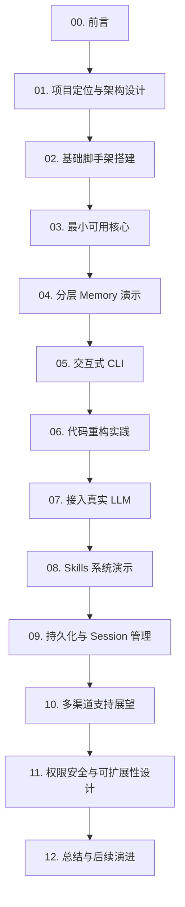

# 00. 前言

## 这个教程是做什么的？

这是一个**从零开始搭建极简个人 AI 助理 Harness**的入门实战记录，也是一本**Harness 小册**。

我们需要明确的是，本教程最终实现的产品 **hachimi** 目前并不是一个开箱即用的成熟生产级个人助理，而是一个**用于学习与演示 Agent 底层控制流设计**的最小化 Demo，不过它也在持续进化中。

通过构建这个 Demo，我们旨在展示：
- **Harness 控制循环**：如何使用 TypeScript 和大语言模型（LLM）搭建最基础的“思考 -> 工具调用”状态循环。
- **记忆（Memory）概念演练**：演示分层记忆（Session 与 Long-term）的设计逻辑，展示如何用最简单的规则将记忆动态注入系统上下文。
- **解耦设计**：演示如何将核心 Harness 与具体的接入渠道（例如命令行 CLI）进行分离，预留未来的扩展点。
- **技能（Skills）架构思想**：展示如何通过 Lazy Loading 思想在系统 Prompt 中注入技能清单。

我们希望通过这套精简的玩具代码，帮助你理解像 Claude Code、Pi 等复杂 Agent 产品背后的控制流骨架。

---

## 为什么要自己写 Harness ？

2025 至 2026 年间，市面上虽然有许多优秀的 AI 编程助手和 Agent 商业化产品，但它们的内部调度逻辑往往过于复杂和封闭。

自己亲手写一个极简的 Harness 玩具底座，能够帮助我们：
1. **看清黑盒内部**：摆脱 LangChain、Claude Agent SDK、Pi Agent 等第三方框架的繁重抽象，用原生的 Node.js 逻辑清晰地看明白大模型与工具是如何一步步交互的。
2. **理解资源开销**：直观感受每一次工具调用（Tool Calling）所消耗的 Token 以及网络请求带来的延迟。
3. **掌握工程演进路线**：体验一个项目是如何从“零行代码”一步步演进出各种新模块的，建立健康的工程迭代思维。

---

## 教程的写作方式

本教程采用「**边开发边记录**」的 MVP 演进驱动方式：
- 每个阶段的代码都追求极致精简，确保只包含演示该功能所需的最少代码。
- 我们会老老实实地记录开发过程中由于设计不周而产生的 Bug（如工具循环调用死循环），并展示如何通过重构来纠正它们。
- 每一个演进阶段（Phase）在配套的 [hachimi](https://github.com/ares0x/hachimi) 代码仓库中都有对应的分支，方便你随时对比和跟做。

---

## 适合谁看？

- 对 TypeScript / Node.js 比较熟悉，对大模型 Agent 原理感兴趣的开发者。
- 希望自己动手实现一个最简 ReACT 控制流循环的人。
- 觉得 LangChain 等现有框架太重，想从底层原生代码开始理解 Agent 运行逻辑的朋友。

> [!WARNING]
> **不适合**：完全没有编程基础，或者希望获得一个功能强大、直接能用于生产环境的商业助理软件的用户。

---

## 教程目录一览

我们按照从易到难、小步快跑的节奏将这个基础 Demo 的开发流程拆分为 12 章：

> [!IMPORTANT]
> **版本与后续演进提示**：
> 1. 配套主代码仓库 [hachimi](https://github.com/ares0x/hachimi) 的 **`tutorial` 分支** 对应本 L1 阶段教程的所有演示代码。
> 2. `hachimi` 后续还会进行更系统的改进。在它演进的同时，我们也将在后续持续推出全新的教程合集系列（如 L2 进阶篇等），敬请期待！

下一章我们正式开始：[项目定位与整体架构设计](01-项目定位与架构设计.md)。
