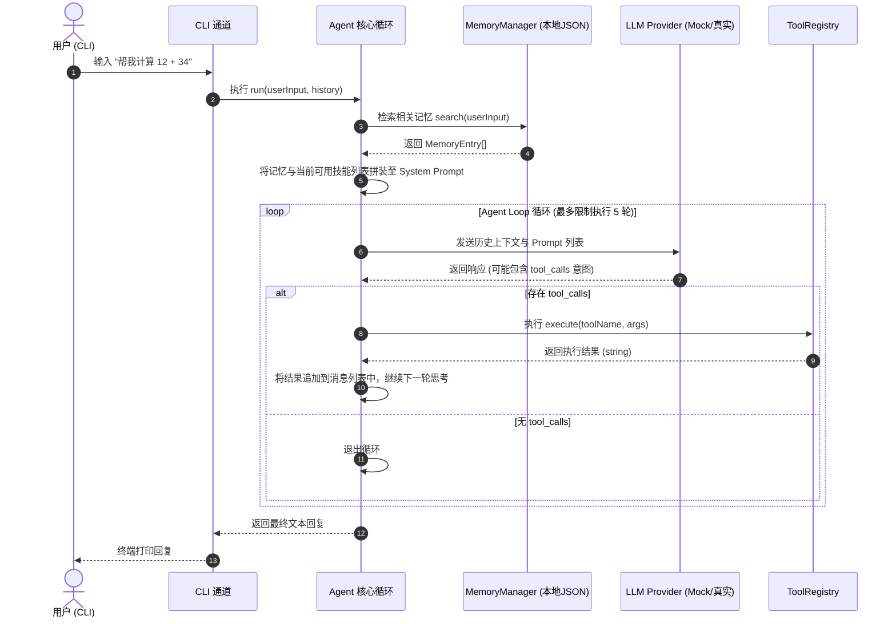

# 01. 项目定位与架构设计

## 我们到底要做什么？

在开始动手编写第一行代码之前，我们必须非常明确项目的边界与定位。

**hachimi 的核心定位是一个用以演示「个人助理」核心交互逻辑的极简 Agent Harness 原型。**

- **极简原型（Minimal Prototype）**：它不具备商用产品的复杂功能。我们的主要目的是提供一个可读性极高、方便本地跑通的最小化“轮子”。
- **Harness**：我们重点演示的是大模型的外围控制层（Harness），即大模型如何接收输入、在什么时机决定调用工具、如何向系统返回响应。

```text
┌───────────────────────────────────────┐
│              大模型 (LLM)              │  (提供基础自然语言推理)
└──────────────────┬────────────────────┘
                   │
                   ▼
┌───────────────────────────────────────┐
│          Harness 演示层 (Demo)         │  (通过代码拼接 System Prompt 和上下文)
│  ┌──────────┐ ┌──────────┐ ┌───────┐  │
│  │  Memory  │ │  Skills  │ │ Tools │  │
│  └──────────┘ └──────────┘ └───────┘  │
└──────────────────┬────────────────────┘
                   │
                   ▼
┌───────────────────────────────────────┐
│             CLI 对话终端               │  (本地演示用的输入输出渠道)
└───────────────────────────────────────┘
```

---

## 为什么不直接使用成熟的 LangChain 等框架？

对于初学者来说，成熟的 Agent 框架（如 LangChain、Claude Agent SDK、Pi Agent）内部封装了极其厚重的层级结构和隐式调用。直接使用它们虽然能快速拼装应用，但很难帮我们看清以下底层技术细节：
1. **大模型的原始数据往返**：大模型调用接口收到的 `messages` 数组究竟长什么样？
2. **工具调用的原始报文**：模型是如何用文本描述“我想调用计算器工具”的？
3. **控制循环的终止条件**：程序是如何防范模型出现持续调用工具死循环的？

手写一个极简的 Harness 能够让我们用几百行 TypeScript 原生代码把这些问题彻底拆解清楚。

---

## 设计原则

为了降低学习成本，`hachimi` 遵循以下四条核心设计原则：

1. **核心逻辑（Core）与接入通道（Channels）的分离思路**
   尽管 L1 我们只提供命令行 CLI 交互，但我们在代码结构上进行了预留：核心包 `@hachimi/core` 尽量保持只做数据输入与输出，不直接读写特定终端。
2. **最简概念演示，拒绝过度设计**
   不引入复杂的数据库、Docker 运行沙箱或云端同步机制。记忆存储采用本地 JSON 文件，LLM 请求采用原生 `fetch`。
3. **先跑通，再系统化重构**
   本章会引导读者先通过一个完全没有网络开销的 `MockLLM` 跑通 ReACT 循环，确保掌握逻辑本质后，再接入真实 API。
4. **演示惰性技能装载（Lazy Skills）**
   模拟大型 Agent 如何精简系统提示词（System Prompt），仅向模型提供已配置技能的极简大纲。

---

## 整体架构与数据流向

下面是 `hachimi` 极简控制流的 Mermaid 序列图：



---

## 技术选型

- **运行时**：Node.js 22 。
- **包管理**：`pnpm` Workspaces (用以演示 Monorepo 下多包之间如何互相引入本地依赖)。
- **开发语言**：TypeScript (提供编译期的类型契约校验)。

---

## 阶段式开发演进

为了让初学者更平滑地上手，我们将开发过程拆分为以下几个实验阶段：

1. **第 2、3 章**：Monorepo 脚手架搭建与完全在本地运行的 Mock 极简 ReACT 控制循环。
2. **第 4、5 章**：通过最简的本地 JSON 读写演示分层记忆与交互式 Readline CLI 终端。
3. **第 6、7 章**：代码重构与接入通用的 OpenAI 协议（支持 DeepSeek）。
4. **第 8、9 章**：演示 Skills 技能注入与 Session 会话消息累积。
5. **第 10、11 章**：安全审批属性（`requiresApproval`）定义与多渠道接口解耦设计思考。

下一章我们将从零开始搭建开发脚手架：[基础脚手架搭建](02-基础脚手架搭建.md)。
